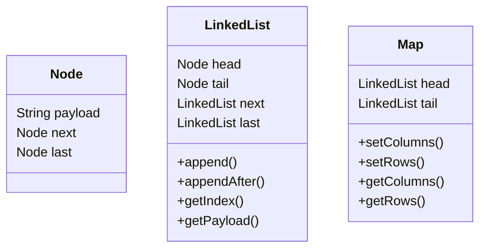

# roguelike-map

#### By: Nicholas P. Norman
#### April 2023

# Main Goal

The goal of this project is to create an algorithm that can make command-line "map" that generates randomly with rooms and paths.

# Use Case

This can be used by a command-line game developer to generate maps.

# Input

An amount of columns and rows.

# Output

A command-line ouput and an linked-list.

#### Expected Output

Where 'X' represents a node with an associated object.

----x-  
-xx-x-  
--xxx-  
--x---  

## Classes

